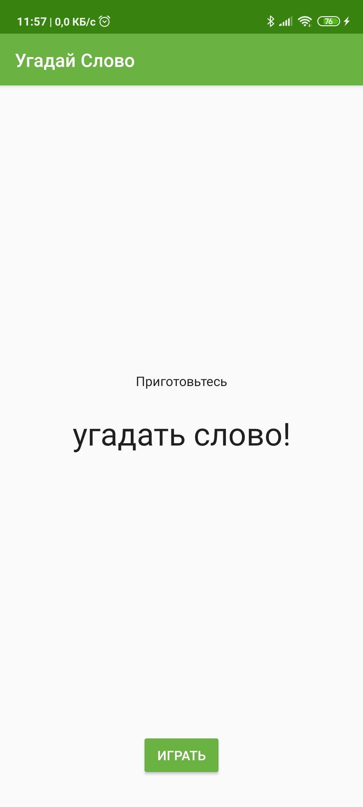
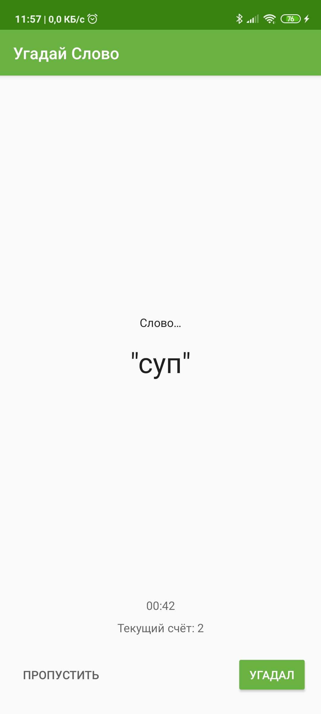
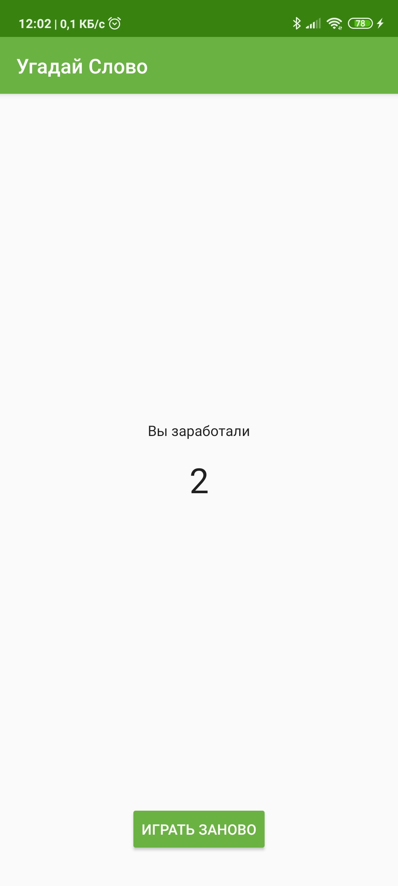

## Guess It!
"Угадай слово" - это приложение для угадывания слов, в которое вы можете играть с одним или несколькими друзьями. Чтобы играть, держите устройство в ландшафтном режиме, повернув его лицом от себя, положив большие пальцы на кнопки "Пропустить" и "Угадал". Затем ваши друзья могут дать вам подсказки, чтобы помочь вам угадать слово.

Если вы правильно поняли слово, нажмите "Угадал". Если вы застряли, нажмите "Пропустить", но будьте внимательны, пропуская слово вы теряете очки. Игра длится минуту, а затем показывает вам ваш счет.

## Screenshots

  
